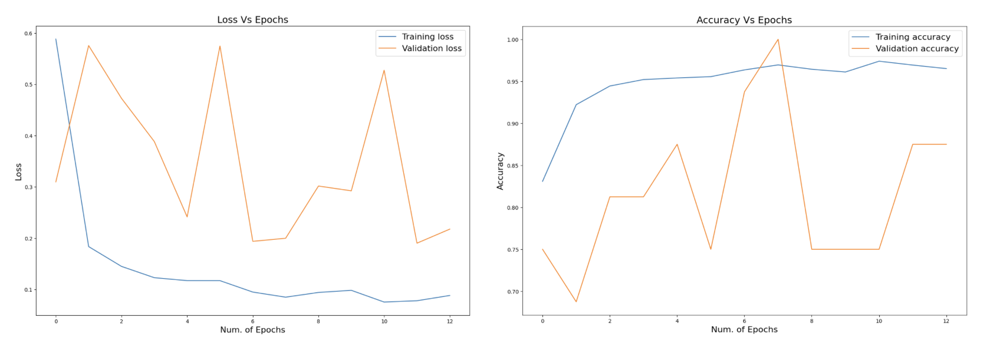

# Pneumenia Detection using DEEP CNN Models

## Background
- Pneumonia is a severe respiratory infection that affects millions of people around the world.

- Early diagnosis and treatment of pneumonia are critical for avoiding complications and lowering mortality rates.

- Analysing chest X-ray images is one approach to early detection of pneumonia.

## Goal 
- VGG19 is a popular and very deep pre-tarined DEEP CNN model. 

- We believe it can outperform other CNN models in this case, and that's our hypothesis.

- We plan to make our custom VGG19 model, and compare it's performance with Resnet50 and InceptionV3 models.

## About the Dataset
- For this study, used a Kaggle dataset [Chest X-Ray Images](https://www.kaggle.com/datasets/paultimothymooney/chest-xray-pneumonia). 

- The dataset is organized into 3 folders (train, test, val) and contains subfolders for each image category (Pneumonia/Normal). 

- It consists of 5,863 X-Ray images (JPEG) and 2 output categories (Pneumonia/Normal).

## Training Process
- The comparisons and finding are based on the model configurations we implemented:

  1. Batch Size = 128  
  2. Number of epochs = 13
  3. Limited number of layers

- Performed:

  1. Data Augmentation
  2. Model architecture adjustments
  3. Hyperparameter tuning
  4. Performance Comparison


## Results
1. On Train & Validation Set : 
    ```
    Training Loss Value = 0.0883        			Validation Loss Value = 0.1999
    Training Accuracy Value = 96.51% 			
    Validation Accuracy Value = 100%
    ```

2. On Test Set:
	```
    Testing Loss Value = 0.2335        			
    Testing Accuracy Value = 91% 
    ```

3. Loss vs Epochs and Accuracy vs Epochs Plots


<!--  -->

4. Comparison with other DEEP CNN Models


## Conclusion

- Based on the comparison results, it can be observe that our model (VGG19) works better than the previously used models, and thus, answers our hypothesis.

